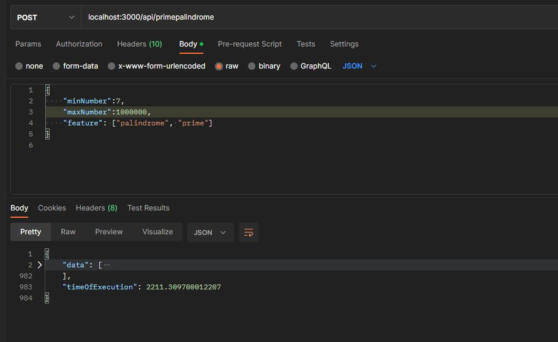

<div id="top"></div>
<!--
*** Thanks for checking out the backendTaskHorizontLabs. If you have a suggestion
*** that would make this better, please fork the repo and create a pull request
*** or simply open an issue with the tag "enhancement".
*** Don't forget to give the project a star!
*** Thanks again! Now go create something AMAZING! :D
-->


<!-- PROJECT SHIELDS -->
<!--
*** I'm using markdown "reference style" links for readability.
*** Reference links are enclosed in brackets [ ] instead of parentheses ( ).
*** See the bottom of this document for the declaration of the reference variables
*** for contributors-url, forks-url, etc. This is an optional, concise syntax you may use.
*** https://www.markdownguide.org/basic-syntax/#reference-style-links
-->
[![Contributors][contributors-shield]][contributors-url]
[![Forks][forks-shield]][forks-url]
[![Stargazers][stars-shield]][stars-url]
[![Issues][issues-shield]][issues-url]
[![MIT License][license-shield]][license-url]
[![LinkedIn][linkedin-shield]][linkedin-url]

<!-- ABOUT THE PROJECT -->
## About The Project
This repo implements a REST API endpoint using NodeJs and express. 


The endpoint takes in three arguments
- minNumber
- maxNumber
- features

The response from the api is:
- data : (array) should contain all the numbers that are palindromes or primes or that are
  palindromes and primes at the same time based on the feature parameter.
- timeOfExecution :(float in milliseconds) time of how long it took to get the results


### Built With

* [Node.js](https://nodejs.org/)

<p align="right">(<a href="#top">back to top</a>)</p>

<!-- GETTING STARTED -->
## Getting Started

To run this project ensure you have nodejs installed on your system Find instructions on the [Node.js documentation](https://nodejs.org/)


### Installation


1. Clone the repo
   ```sh
   git clone https://github.com/wamaithanyamu/backendTaskHorizontLabs.git
   ```
2. Install NPM packages
   ```sh
   npm install
   ```
3. Run server
   ```sh
   npm start
   ```

<p align="right">(<a href="#top">back to top</a>)</p>


<!-- USAGE EXAMPLES -->
## Usage

You can test the endpoint using postman as shown below



## Big O and space compelxity

The prime numbers algorithm used is the Sieve of Eratosthenes which has a complexity of n*log(log(n))
The palindrome algorithm has a complexity of O(n). However, the algorithm has been  sped up by comparing two halves of a number instead of comparing two strings. 
<!-- LICENSE -->
## License

Distributed under the MIT License. See `LICENSE.txt` for more information.


<!-- MARKDOWN LINKS & IMAGES -->
<!-- https://www.markdownguide.org/basic-syntax/#reference-style-links -->
[contributors-shield]: https://img.shields.io/github/contributors/wamaithanyamu/backendTaskHorizontLabs.svg?style=for-the-badge
[contributors-url]: https://github.com/wamaithaNyamu/backendTaskHorizontLabs.git/graphs/contributors
[forks-shield]: https://img.shields.io/github/forks/wamaithanyamu/backendTaskHorizontLabs.svg?style=for-the-badge
[forks-url]: https://github.com/wamaithaNyamu/backendTaskHorizontLabs.git/network/members
[stars-shield]: https://img.shields.io/github/stars/wamaithanyamu/backendTaskHorizontLabs.svg?style=for-the-badge
[stars-url]: https://github.com/wamaithaNyamu/backendTaskHorizontLabs.git/stargazers
[issues-shield]: https://img.shields.io/github/issues/wamaithanyamu/backendTaskHorizontLabs.svg?style=for-the-badge
[issues-url]: https://github.com/wamaithaNyamu/backendTaskHorizontLabs.git/issues
[license-shield]: https://img.shields.io/github/license/wamaithanyamu/backendTaskHorizontLabs.svg?style=for-the-badge
[license-url]: https://github.com/wamaithaNyamu/backendTaskHorizontLabs.git/blob/master/LICENSE.txt
[linkedin-shield]: https://img.shields.io/badge/-LinkedIn-black.svg?style=for-the-badge&logo=linkedin&colorB=555
[linkedin-url]: https://linkedin.com/in/wamaithanyamu

